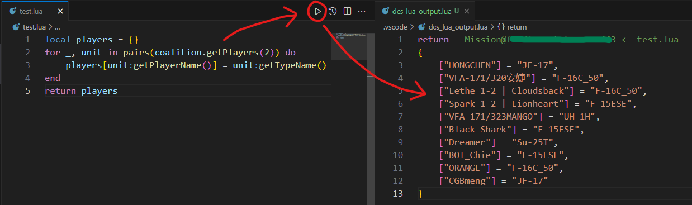
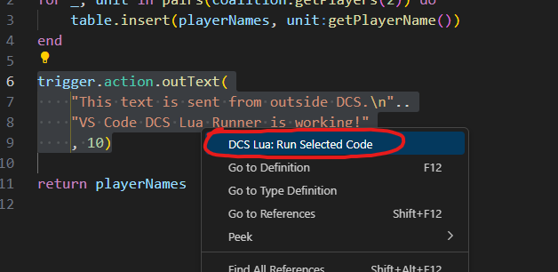
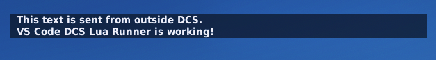

# DCS Lua Runner

A VS Code extension to run lua code in DCS World (on local or remote server, in mission or GUI environment). A reimplementation of the  [DCS Fiddle](https://github.com/JonathanTurnock/dcsfiddle) web lua console.

Allows for quick development and debugging of running scripted missions directly from the comfort of VS Code.  

  

## Features
- Send whole Lua file or just selected portion of code.
- Execute on local DCS instance or remote DCS server (more details below).
- Execute in mission or GUI scripting environment.
- Display return value in output panel or as a file (for syntax highlight)
    - in either JSON or Lua table format.

## Requirements

### DCS Hooks Installation
Install DCS Fiddle script the same way as the original web version, and de-sanitize mission scripting.   
[**Original instruction here**](https://dcsfiddle.pages.dev/docs)

All credits of this scripts and its API implementations go to the original authors [JonathanTurnock](https://github.com/JonathanTurnock) and [john681611](https://github.com/john681611).

### Important
If you want to run code on a remote DCS server, you need to expose its Fiddle port (12080 by default). This however, creates a security risk, as everyone can now inject lua code into your server. 

It is recommended to install this [modified Fiddle script](src/hooks/dcs-fiddle-server.lua). It allows you configure a basic authentication at the beginning of the file. 

For even better security, put the Fiddle port behind a reverse proxy with HTTPS. 

## Extension Settings

This extension has the following settings:

- `serverAddress`: Remote DCS server address. It can be an IP address or a domain.

- `serverPort`: Port of the remote DCS Fiddle. Default is `12080`.

- `useHttps`: Specifies whether the server is behind a HTTPS reverse proxy.   
If this is set to `true`, you should also change the `dcsLuaRunner.serverPort` to `443`.   
Default is `false`.

- `webAuthUsername`: Specifies the username for authentication.   
**Requires the modified DCS Fiddle script.**

- `webAuthPassword`: Specifies the password for authentication.   
**Requires the modified DCS Fiddle script.**

- `runCodeLocally`: Whether to send code to `127.0.0.1:12080` or to the remote server set in `dcsLuaRunner.serverAddress` and `dcsLuaRunner.serverPort`.   
This setting can be quickly changed with the buttons on the upper-right of a lua file.

- `runInMissionEnv`: Specifies whether to execute in mission or GUI Scripting Environment.  
This setting can be quickly changed with the buttons on the upper-right of a lua file.

**NEW:**
- `returnDisplay`: Wether to use output panel or file (which supports syntax highlight) to display return value.

- `returnDisplayFormat`: Display return value as JSON or Lua table. (Experimental feature, please report any issue.)

## Release Notes

See [**changelog**](CHANGELOG.md).

## Credits
[**DCS Fiddle**](https://github.com/JonathanTurnock/dcsfiddle) by [JonathanTurnock](https://github.com/JonathanTurnock) and [john681611](https://github.com/john681611).

## License

This project is licensed under the MIT License - see the [LICENSE](LICENSE.md) file for details.