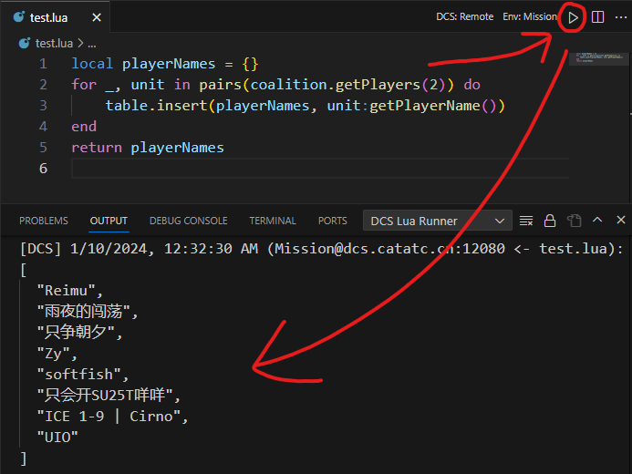

# DCS Lua Runner

A VS Code extension to run lua code in DCS World (local or remote server). A reimplementation of the  [DCS Fiddle](https://github.com/JonathanTurnock/dcsfiddle) web lua console.

Allows for quick development and debugging of running scripted missions directly from the comfort of VS Code.  

  

## Features

- Send Lua code to run on local DCS or remote DCS server.
- Run in mission or GUI scripting environment.
- Right click and run only selected part of code. 
- Display return value from DCS.
- Fully compatible with existing DCS Fiddle hooks script.
- Optional basic web auth for better public server security (see requirements).

## Requirements

### DCS Hooks Installation
Install DCS Fiddle script the same way as the original web version, and de-sanitize mission scripting.   
[**Original instruction here**](https://dcsfiddle.pages.dev/docs.)

All credits of this scripts and its API implementations go to the original authors [JonathanTurnock](https://github.com/JonathanTurnock) and [john681611](https://github.com/john681611).

### Important
If you want to run code on a remote DCS server, you need to expose its Fiddle port (12080 by default). This however, creates a security risk, as everyone can now inject lua code into your server. 

It is recommended to install this [modified Fiddle script](src/hooks/dcs-fiddle-server.lua). It allows you configure a basic authentication at the beginning of the file. 

For even better security, put the Fiddle port behind a reverse proxy with HTTPS. 

## Extension Settings

This extension contributes the following settings:

- `dcsLuaRunner.serverAddress`: Remote DCS server address. It can be an IP address or a domain.

- `dcsLuaRunner.serverPort`: Port of the remote DCS Fiddle. Default is `12080`.

- `dcsLuaRunner.useHttps`: Specifies whether the server is behind a HTTPS reverse proxy.   
If this is set to `true`, you should also change the `dcsLuaRunner.serverPort` to `443`.   
Default is `false`.

- `dcsLuaRunner.webAuthUsername`: Specifies the username for authentication.   
**Requires the modified DCS Fiddle script.**

- `dcsLuaRunner.webAuthPassword`: Specifies the password for authentication.   
**Requires the modified DCS Fiddle script.**

- `dcsLuaRunner.runCodeLocally`: Whether to send code to `127.0.0.1:12080` or to the remote server set in `dcsLuaRunner.serverAddress` and `dcsLuaRunner.serverPort`.   
This setting can be quickly changed with the buttons on the upper-right of a lua file.

- `dcsLuaRunner.runInMissionEnv`: Specifies whether to execute in mission or GUI Scripting Environment.  
This setting can be quickly changed with the buttons on the upper-right of a lua file.

## Known Issues

The return value is displayed on in the output window, which unfortunately does not support syntax highlight. Possibilities to display return in other ways are being looked into.

## Release Notes

See [**changelog**](CHANGELOG.md).

## Credits
[**DCS Fiddle**](https://github.com/JonathanTurnock/dcsfiddle) by [JonathanTurnock](https://github.com/JonathanTurnock) and [john681611](https://github.com/john681611).